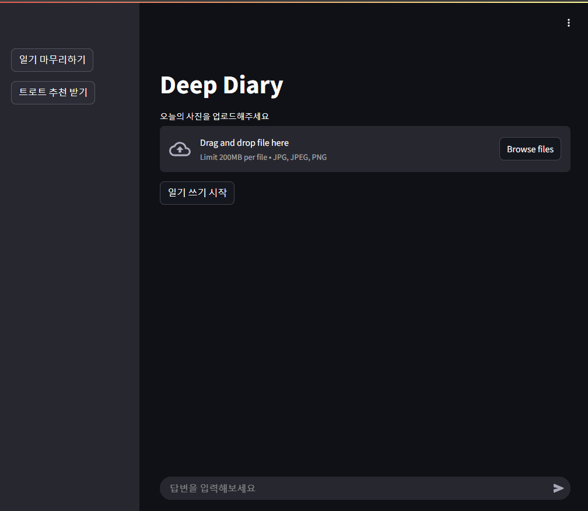
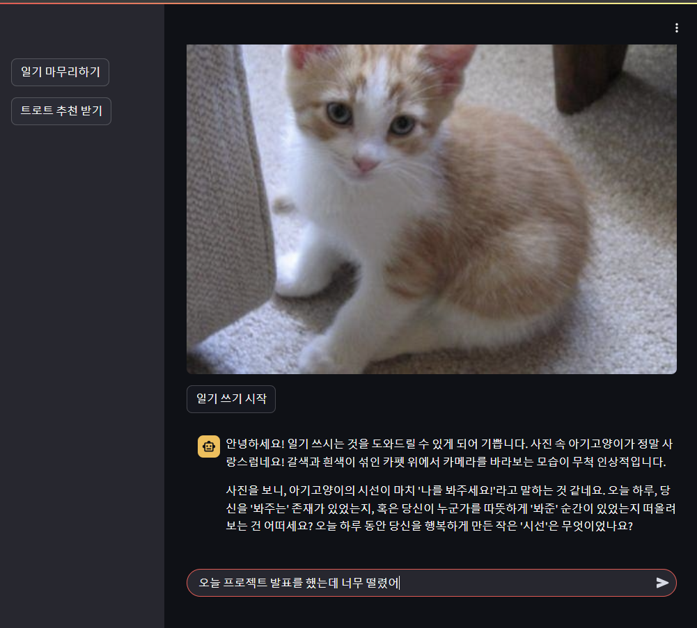
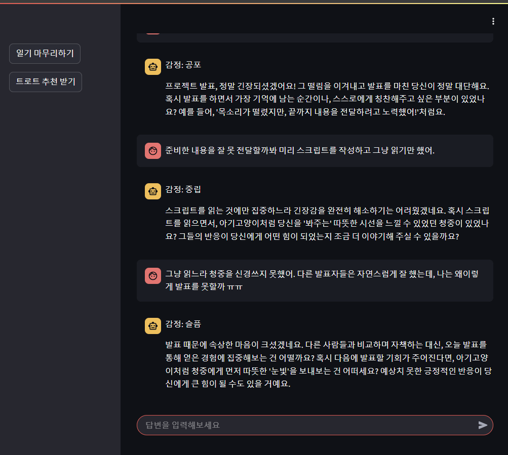
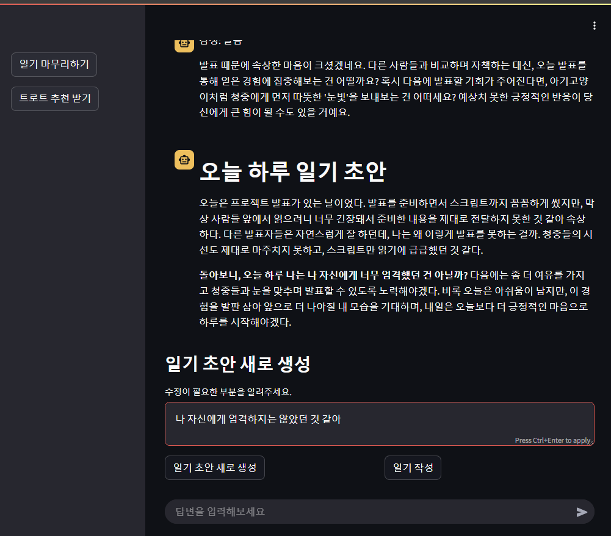
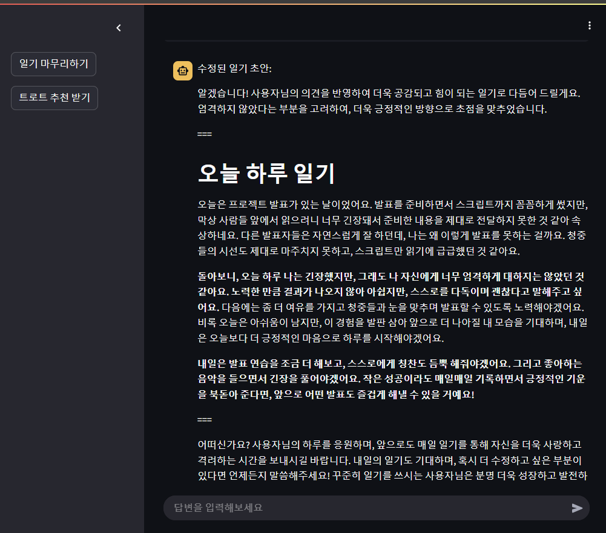
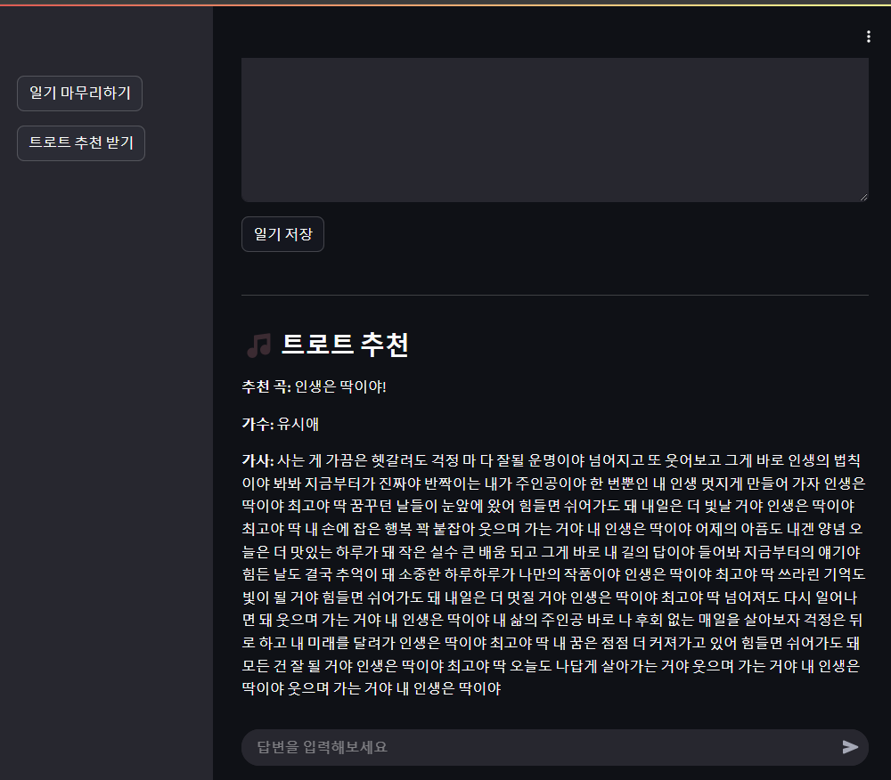

---
## 🚀 **Deep Diary - AI 기반 감성 일기 작성 서비스**  
> AI와 함께하는 감성 일기 작성 ✨  
> **Deep Diary**는 이미지와 대화를 기반으로 **사용자의 감정을 분석하고, 감성적인 일기를 생성**하는 서비스입니다.  

---

## 📌 **서비스 개요**
**Deep Diary**는 다음과 같은 핵심 기능을 제공합니다.

##  👤 **나의 역할**
전체 서비스 흐름 설계 및 구조 정의
이미지 업로드 → 감정 추출 → 질문 생성 → 대화형 응답 → 일기 초안 생성 → 감정 변화 인사이트 추적 구조 설계

감정 분석 → 질문 생성 → 일기 작성 흐름을 LLM으로 구성하고, 각 기능을 단계별로 정의

기분 전환 활동 추천 로직 기획 및 반영

### 🔹 **1. 이미지 캡션 생성 (`LLaVA AI`)**  
- 사용자가 업로드한 이미지를 분석하여 AI가 **이미지 설명(캡션)**을 자동으로 생성합니다.  
- 이 설명을 기반으로 AI가 사용자의 감정을 반영한 **대화형 일기 작성을 유도**합니다.  

### 🔹 **2. AI 기반 대화 (`Gemini API`)**  
- AI가 이미지에 대한 **첫 번째 질문**을 제공합니다.  
- 사용자가 응답하면 AI가 **추가 질문을 생성**하여 자연스러운 대화를 이어갑니다.  
- 사용자의 감정을 분석하여 **개인 맞춤형 대화 흐름**을 제공합니다.  

### 🔹 **3. 감정 분석 (`KoBERT 모델`)**  
- 사용자의 응답을 분석하여 **감정(기쁨, 슬픔, 놀람, 분노, 중립 등 7가지 감정)**을 자동으로 분류합니다.  
- 감정 데이터를 기반으로 **맞춤형 일기 초안을 생성**합니다.  

### 🔹 **4. 감성 일기 초안 생성 (`Gemini API`)**  
- AI가 **대화 내용을 요약하고, 감정을 반영한 일기 초안을 작성**합니다.  
- 사용자가 원하는 방향으로 **수정 요청을 반영하여 일기 초안을 재작성**할 수도 있습니다.  

### 🔹 **5. 감정 기반 트로트 추천 (`E5 임베딩 & 유사도 분석`)**  
- **일기 내용을 분석**하여 감정과 유사한 트로트 가사를 찾아 추천합니다.  
- 사용자의 감성과 어울리는 노래를 찾아주는 맞춤형 추천 기능! 🎵  

---

## 🛠 **기술 스택**
### **🔹 프론트엔드**
- **Streamlit** (`Python`)  
  - 사용자가 이미지를 업로드하고, AI와 대화하며, 감성 일기를 작성하는 인터페이스 제공  

### **🔹 백엔드**
- **FastAPI** (`Python`)  
  - AI 모델 서빙 및 API 엔드포인트 관리  

### **🔹 AI 모델**
- **LLaVA 1.5** → **이미지 캡션 생성** (`LLaVA-1.5-7B-hf`)  
- **Gemini AI** → **대화 및 일기 초안 생성**  
- **KoBERT** → **감정 분석**  
- **E5-Large Embedding** → **트로트 가사 추천 (Semantic Similarity 분석)**  

### **🔹 데이터 저장**
- 클라이언트별 **세션(`session_id`)을 유지**하여 개별적인 대화 저장  
- 사용자의 **대화 기록 및 감성 분석 결과를 `logs/{session_id}` 폴더에 저장**  

# Wanted_DLproject

https://www.notion.so/DL_project-1a0aa52f04eb80798a9cc87b0f1f506f

---

## 서비스 화면







---

## GIT 명령어 관련
### git clone
```$ git clone https://github.com/DeepDiary/Wanted_DLproject.git```

### 대용량 파일 관리
```$ git lfs install```

### 자주쓰는 git 명령어

```
$ git log  # commit 내역 확인
```
```
$ git status  # 현재 파일 변경 상태 확인
```
```
$ git diff  # 파일 변경 내용 확인
```
```
$ git restore [파일경로]
  # 특정 파일의 수정 내용을 마지막 커밋으로 되돌리기
  # ex. git restore notebooks/eda_ikh.ipynb
  # (주의) 수정한 내용이 사라집니다
```
```
$ git branch
$ git checkout
$ git merge
```


### 서버에서 작업할 때
```
$ git -c user.name="YourName" -c user.email="YourEmail@example.com" add .  
$ git -c user.name="YourName" -c user.email="YourEmail@example.com" commit -m "커밋 메시지"  
$ git -c user.name="YourName" -c user.email="YourEmail@example.com" push
```

### 서버 접속
```
# 교육장 내부 접속
$ ssh wanted-1@192.168.10.96
```
```
# 외부 접속(tailscale 이용)
$ ssh wanted-1@100.83.113.125
```

### 모델 복사
```
scp -r wanted-1@100.83.113.125:/home/wanted-1/potenup-workspace/Project/project3/team1/Wanted_DLproject/models/llava-1.5-7b-hf/ ./models/.
```

### 샘플 테스트 실행
```
$ python ./service/deep_diary.py
```

### FastAPI 백엔드 실행 및 테스트
```
$ uvicorn service.main:app --host 0.0.0.0 --port 8031 --reload
$ nohup uvicorn service.main:app --host 0.0.0.0 --port 8031 > service/logs/uvicorn.out 2>&1 &  # 시연
```
http://localhost:8031/docs
http://192.168.10.96:8031/docs
http://100.83.113.125:8031/docs

### streamlit 프론트엔드 실행 및 테스트
```
$ streamlit run service/app.py --server.port 8531
$ nohup streamlit run service/app.py --server.port 8531 > service/logs/streamlit.out 2>&1 &  # 시연
```
http://localhost:8531
http://192.168.10.96:8531
http://100.83.113.125:8531
